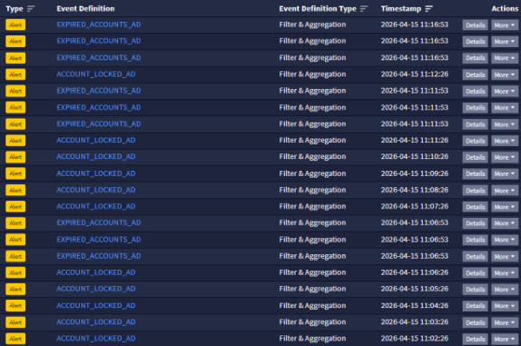
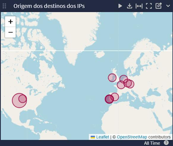

# Graylog SIEM Lab

This project demonstrates the implementation of a SIEM solution using Graylog for centralized log collection, analysis, and alerting.

---

## Technologies Used
- Graylog
- Ubuntu Server
- Winlogbeat / Filebeat
- Syslog
- MongoDB

---

## Architecture
- Single-node Graylog deployment on Ubuntu Server
- Log collection from:
  - Windows systems (Winlogbeat)
  - Linux systems (Syslog)
  - Network devices (firewall, access points)
  - Web server (IIS logs)
- Centralized processing, normalization, and analysis

---

## Log Sources Integrated

| Source | Type of Logs | Input | Protocol |
|--------|-------------|------|----------|
| Windows | Event Logs (Security, System) | BEATS_WINDOWS | TCP |
| Linux | Syslog (auth.log, syslog) | SYSLOG_LINUX | UDP |
| Firewall (Draytek) | Network / Firewall logs | SYSLOG_DRAYTEK | UDP |
| Access Points (Unifi) | Authentication / WiFi logs | SYSLOG_UNIFI | UDP |
| IIS Web Server | HTTP/HTTPS logs | BEATS_IIS | TCP |

---

## Features
- Centralized log collection from multiple systems
- Log parsing and normalization using pipelines
- Event correlation across sources
- Security dashboards and monitoring
- Alerting system with email notifications
- GeoIP enrichment for network analysis

---

## Normalization Example

| Original Field | Normalized Field |
|----------------|------------------|
| srcip | src_ip |
| source_ip | src_ip |
| client_ip | src_ip |
| dstip | dst_ip |
| destination_ip | dst_ip |

---

## Use Cases

### Failed Login Detection
Detection of repeated failed authentication attempts (Event ID 4625).

### Account Lockout Monitoring
Monitoring locked user accounts (Event ID 4740).

### Server Restart Detection
Detection of system restarts (Event ID 1074).

### Network Traffic Monitoring
Analysis of firewall activity and blocked connections.

### VPN Activity Monitoring
Detection of VPN connections and failed authentications.

---

## Sample Queries

| Use Case | Query |
|-----------|------|
| Failed Login | winlogbeat_event_code:4625 |
| Account Locked | winlogbeat_event_code:4740 |
| Server Restart | winlogbeat_event_code:1074 |
| Remote Desktop Login | winlogbeat_event_code:4624 AND LogonType:10 |

---

## Alerts

| Alert Name | Event ID | Condition | Severity |
|-----------|--------|----------|----------|
| Account Locked | 4740 | COUNT >= 1 | High |
| Server Restart | 1074 | COUNT = 1 | High |
| Failed Logins | 4625 | Multiple attempts | High |

---

## Alerts Example

---

## GeoIP Analysis

GeoIP enrichment was implemented using MaxMind databases to add geographic context to network logs.

This allows:
- Identification of traffic origin and destination
- Detection of suspicious external connections
- Better visibility of global network activity

### GeoIP Example

---

## Pipelines and Processing

Custom pipelines were implemented to:
- Extract relevant fields (IP, user, ports, event type)
- Normalize logs across different sources
- Enrich events with additional context (GeoIP)

---

## Project Context

This project was developed as part of a cybersecurity internship, focusing on SIEM implementation, log analysis, and real-time security monitoring.

The solution provides:
- Centralized visibility over infrastructure logs
- Detection of security events and anomalies
- Automated alerting and monitoring
- Practical experience with SIEM tools and security operations
